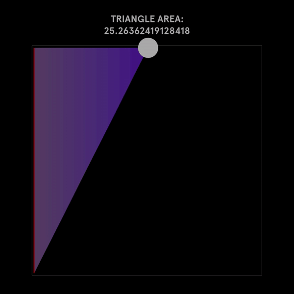
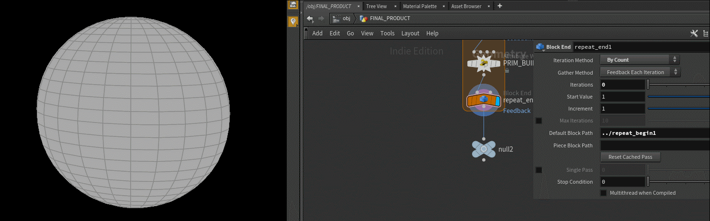

# Poly_Split_Blog
Total WIP. For Educational Use only.

Currently this reads like some drunk dude tried to write about polygon splitting...

# Random Splits

I'm a pretty big fan of greebling, and I've been generally unimpressed with most of the greebling methods I've seen in Houdini and other apps. I figured the smartest approach would be to actually partition the mesh, as opposed to instance things onto the mesh. Most methods I've seen in Houdini that attempt this problem, require some double for-each block fuckery which is just gross in my eyes. Any time you do a double for-each block some kid, somewhere, gets put up for adoption. You're literally a monster if you use them. Normally I'm okay with being that monster too, but the insanity described in this video: https://www.youtube.com/watch?v=IZoUdVS2Rw0 is just unacceptable in terms of speed and controllability. No offense to the author of the video, this is still a great non-vex based approach. 

Our goal is quite simple, given an input `mesh`, add some random AXIS ALIGNED division to each face in the mesh, and then repeat. Mesh is highlighted because most approaches I've seen really only cover flat 2d surfaces, which is b o r i n g. 

One last caveat is that this will only work for quads, aka polygons with only 4 points.

So let's drop down a grid to start with and set its divisions on each axis to two. For the purposes of this article im going to break the process down into a bunch of smaller algorithms that we can combine together to reach our intended result. 

## Defining our Split Locations

Since we're all houdini experts, we probably know that built into VEX is a nifty function called `primuv()`. What makes this function so amazing is that it interpolates any given attribute over the polygon, at some arbitrary UV value, including position. In the case of a quad, each corner of the quad will correspond with corners of that arbitrary UV Map ([0, 0], [1, 0], [0, 1], and [1, 1] respectively). Assuming we want to split on the UV's x-axis, we would then want to define our split positions as so (make sure you read the code comments too, you dorks):
```c
//Where r is some random value from 0-1;

vector split_uv_A = set(0, r);
vector split_uv_B = set(1, r);

vector split_pos_A = primuv(0, "P", 0, split_uv_A);
vector split_pos_B = primuv(0, "P", 0, split_uv_B);
```

Here's a visual representation of where on a given polygon, valid split locations live:


You might note that in the above gif, we mark corner points as invalid split positions. I would hope it's obvious as to why that is, but if it's not, splitting an edge length-wise, isn't physically possible as an edge in the land of computer graphics, has no width. The term Houdini uses for this is Edge Cusping, and that just disconnects polygons at a given edge, which isn't what we're looking to do. So we should just clamp our input UV to prevent us from accidentally trying to split on a corner! 

Since we want to split based on a given axis direction, we can redefine the above statement for an arbitrary axis like so:

```c
//Where r is some random value from 0-1;
//Where axis is an integer 0 or 1
//Where prim is our current primitive

r = clamp(r, 1e-3, 1. - 1e-3);

vector split_uv_A;
split_uv_A[axis] = 0;
split_uv_A[(axis + 1) % 2] = r;

vector split_uv_B;
split_uv_A[axis] = 1;
split_uv_A[(axis + 1) % 2] = r;

vector split_pos_A = primuv(0, "P", prim, split_uv_A);
vector split_pos_B = primuv(0, "P", prim, split_uv_B);


int A = addpoint(0, split_pos_A);
int B = addpoint(0, split_pos_B);


```

The `(axis + 1) % 2` expression ensures we stay within the bounds of 2 dimensional system, while ensuring we select the off axis.

## Finding the Split Edge

Awesome, we're ready to now begin the splitting process. Now that we know where the two points that make up own new edge live, we need to find the edges that those points live on in the current polygon, in order to rebuild the polygon with proper winding. If you have not read my blog post on Half-Edges, please take some time to skim through it as it's going to make up the core of this algorithm. 

The most simplest use case for half edges is prim-edge traversal. All this means is that starting from one edge in the polygon, we're going to walk around to the next, and subsequently all edges in the polygon, stopping when we return to our initial edge. And in the case of polygon splitting, that's really all we need.


```c 
void random_split(int prim, axis){
	float r = rand(prim);

	vector split_uv_A;
	split_uv_A[axis] = 0;
	split_uv_A[(axis + 1) % 2] = r;

	vector split_uv_B;
	split_uv_B[axis] = 1;
	split_uv_B[(axis + 1) % 2] = r;

	vector split_pos_A = primuv(0, "P", prim, split_uv_A);
	vector split_pos_B = primuv(0, "P", prim, split_uv_B); 
	
	int A = addpoint(0, split_pos_A);
	int B = addpoint(0, split_pos_B);

	int curr_edge = primhedge(0, @primnum); //this selects a random half edge in our prim to start from
	int break_edge = curr_edge;

	do{
			curr_edge = hedge_next(0, curr_edge);
	}while(curr_edge != break_edge);

}
```

So now that we have a method of stepping through our edges we need to come up with a test to find the edge a given position lies on. There are tons of different approaches for this problem, the simplest and fastest method I found, is actually through the use of the cross product.

A plain english breakdown of the steps we need looks like this:
1. Find the direction between the source point of the current edge, and one of our new split positions.
2. Find the direction of the current edge itself, or in other words, the direction between the source point and the destination point in the edge.
3. Find the area of the triangle created by these two vectors.
4. The edge with the smallest area, is the edge our split position lives on.

Step 3 should help explain why we're going to use the cross product.

In school you probably learned that the area of a triangle is `AREA = (Base * Height) / 2` which is correct. But that's not the only way to calculate the area of a triangle, especially if that triangle is defined by 2 vectors of the same origin. The way to express triangular area in terms of vectors is through this formula: `AREA = 0.5 * length(VECTOR_AB x VECTOR_AC)` where A, B and C are all unique points making up our vector triangle, and `x` is the cross product operator. If this is new to you, I really recommend trying it out for yourself to see if you get the same answer both ways. 

Now looking back at the plain english breakdown, you can see that we've ensured our vectors have the same origin, by using the source point in the construction of both. To expand further, a line should have an area of 0, so as our triangle becomes more and more linear, meaning all points converge towards one edge, the area should shrink and shrink. Again meaning, that the edge with the smallest area is also then the edge that contains our splitting point.



However you might note that just having the area doesn't really tell you if the point is inside the polygon, the point could be outside of the polygon, but still be some scaled version of our edge vector. In math terms, this is what's known as two colinear/codirectional vectors. However, because we're using primuv() to determine our split location, we already know the point is within the bounds of the polygon, so this one cross product test is all we need! 

And the final thing to note before we jump into implementation is that we don't actually need to multiply the magnitude of our cross product by half nor do we need to use an accurate distance metric. Meaning we can use squared vector length which is faster in execution, than the euclidean length.

So our edge weight formulation will look like this:
`EDGE_WEIGHT = SQUARED_LENGTH(VECTOR_AB x VECTOR_AC;`

Now that we have a way of finding the edge our new point lives on, let's implement this into our code.
We first need to define a `squared_length()` function as well as an `edge()` function that returns the vector dir of our current edge.

```c
vector edge(int h){
    vector a = point(0, "P", hedge_srcpoint(0, h)), b = point(0, "P", hedge_dstpoint(0, h));
    return b - a;
}

float squared_length(vector a){
    //we aren't testing for distance so we can remove a sqrt() for speed
    return (a.x * a.x) + (a.y * a.y) + (a.z * a.z);
}
```

Rather than define this as a long chunk of code in our `random_split()` function, I'm going to create a new function called, `find_split_edge()` which will return the found edge we want to split!


```c
int find_split_edge(int prim; vector pos){

	int curr_edge = primhedge(0, prim); //this selects a random half edge in our prim to start from
	int break_edge = curr_edge;

	float min_edge_weight = 1; //INIT OUR MINIMUM VAL
	int split_edge;

	do{
		int current_src_pt; vector current_src_pos;
		current_src_pt = hedge_srcpoint(0, curr_edge);

		current_src_pos = point(0, "P", current_src_pt);

		//side A of our triangle
		vector src_split_dir = current_src_pos - pos;

		//side B of our triangle
		vector src_dst_dir = edge(curr_edge);

		//psuedo-triangle area calculation
		float edge_weight = squared_length(cross(src_split_dir, src_dst_dir));
								

		if(edge_weight < min_edge_weight){
			min_edge_weight = edge_weight;
			split_edge = curr_edge;
		}

		curr_edge = hedge_next(0, curr_edge);

	}while(curr_edge != break_edge);

	return split_edge;
}
```

If we're clever in how we think about this, it might become apparent that we don't actually need to find the edge our second split point lives on. The reason being, due to the way we defined our split positions, there is no situation in which those two points will live on the same edge. In fact, the split positions will always have one edge between the two edges they live on.


Surprisingly, we now have all the tools needed to split the polygon. All we need to do now is define our two new prims, and remove our existing prim.

```c
void random_split(int prim, axis){
	float r = rand(prim);

	r = clamp(r, 1e-3, 1 - 1e-3);

	vector split_uv_A;
	split_uv_A[axis] = 0;
	split_uv_A[(axis + 1) % 2] = r;

	vector split_uv_B;
	split_uv_B[axis] = 1;
	split_uv_B[(axis + 1) % 2] = r;

	vector split_pos_A = primuv(0, "P", prim, split_uv_A);
	vector split_pos_B = primuv(0, "P", prim, split_uv_B);

	int A = addpoint(0, split_pos_A);
	int B = addpoint(0, split_pos_B);
	//meshing start
	int current_edge = find_split_edge(prim, split_pos_A);
	int previous_edge = hedge_prev(0, current_edge);

	int A_prim_src_pt, A_prim_dst_pt, B_prim_src_pt, B_prim_dst_pt;

	A_prim_src_pt = hedge_srcpoint(0, current_edge);
	A_prim_dst_pt = hedge_srcpoint(0, previous_edge);

	B_prim_src_pt = hedge_srcpoint(0, hedge_next(0, current_edge));
	B_prim_dst_pt = hedge_srcpoint(0, hedge_prev(0, previous_edge));


	//array of points for prim
	int prim_A_pts[] = array(A_prim_src_pt, A, B, A_prim_dst_pt);

	//repeate prim adding method;
	int prim_B_pts[] = array(B_prim_src_pt, B_prim_dst_pt, B, A);

	//add first prim of two
	int A_prim = addprim(geoself(), "poly", prim_A_pts);
	int B_prim = addprim(geoself(), "poly", prim_B_pts);

	removeprim(0, prim, 0);
}
```


 The final VEX code is below:

```c

vector edge(int h){
    vector a = point(0, "P", hedge_srcpoint(0, h)), b = point(0, "P", hedge_dstpoint(0, h));
    return b - a;
}

float squared_length(vector a){
    //we aren't testing for distance so we can remove a sqrt() for speed
    return (a.x * a.x) + (a.y * a.y) + (a.z * a.z);
}

int find_split_edge(int prim; vector pos){

	int curr_edge = primhedge(0, prim); //this selects a random half edge in our prim to start from
	int break_edge = curr_edge;

	float min_edge_weight = 1; //INIT OUR MINIMUM VAL
	int split_edge;

	do{
		int current_src_pt; vector current_src_pos;
		current_src_pt = hedge_srcpoint(0, curr_edge);

		current_src_pos = point(0, "P", current_src_pt);


		vector src_split_dir = current_src_pos - pos;
		vector src_dst_dir = edge(curr_edge);


		float edge_weight = squared_length(cross(src_split_dir, src_dst_dir)); 
								

		if(edge_weight < min_edge_weight){
			min_edge_weight = edge_weight;
			split_edge = curr_edge;
		}

		curr_edge = hedge_next(0, curr_edge);

	}while(curr_edge != break_edge);

	return split_edge;
}

void random_split(int prim, axis){
	float r = rand(prim);
	r = clamp(r, 1e-3, 1 - 1e-3);

	vector split_uv_A;
	split_uv_A[axis] = 0;
	split_uv_A[(axis + 1) % 2] = r;

	vector split_uv_B;
	split_uv_B[axis] = 1;
	split_uv_B[(axis + 1) % 2] = r;

	vector split_pos_A = primuv(0, "P", prim, split_uv_A);
	vector split_pos_B = primuv(0, "P", prim, split_uv_B);

	int A = addpoint(0, split_pos_A);
	int B = addpoint(0, split_pos_B);

	int current_edge = find_split_edge(prim, split_pos_A);
	int previous_edge = hedge_prev(0, current_edge);

	int A_prim_src_pt, A_prim_dst_pt, B_prim_src_pt, B_prim_dst_pt;

	A_prim_src_pt = hedge_srcpoint(0, current_edge);
	A_prim_dst_pt = hedge_srcpoint(0, previous_edge);

	B_prim_src_pt = hedge_srcpoint(0, hedge_next(0, current_edge));
	B_prim_dst_pt = hedge_srcpoint(0, hedge_prev(0, previous_edge));


	//array of points for prim
	int prim_A_pts[] = array(A_prim_src_pt, A, B, A_prim_dst_pt);

	//repeate prim adding method;
	int prim_B_pts[] = array(B_prim_src_pt, B_prim_dst_pt, B, A);

	//add first prim of two
	int A_prim = addprim(geoself(), "poly", prim_A_pts);
	int B_prim = addprim(geoself(), "poly", prim_B_pts);

	removeprim(0, prim, 0);
}
//We only want to call this on prims!!!
if(len(primpoints(0, @primnum)) == 4) random_split(@primnum, 0);

```

All you gotta do now is call the `random_split()` function in your prim wrangle, and slap this whole thing into a Feedback-Foreach-Block-Thing, and you'll be golden! And remember, this will only work on quads. If you want an ngon solution or a triangle solution, you're gonna need to refactor how you define the split points, and how we mesh the resulting prims.

BAM:



## Next Steps

So if you saw the video I made, which inspired this post ([Watch Here](https://vimeo.com/260308374)) you're probably interested in how I animated it. However I would love to see how ya'll approach the animation portion of this problem. I will eventually make a follow up where I explain in detail what I did. However, I don't want to flood you with too much info right, as most of my blogposts end up wayyyy to long for the average reader. Another fun thing to try, is what if instead of defining a random UV, we use something like `xyzdist()` to define split locations with a set of input points? Fun stuff. Hopefully you've enjoyed this tutorial, and again, like always, please hire me!!!! I'm starvin out here!!! ;n; 

Love,
Jake <3

P.S. All the GIF examples are in the HIP file included in the example folder of this repo! :) 